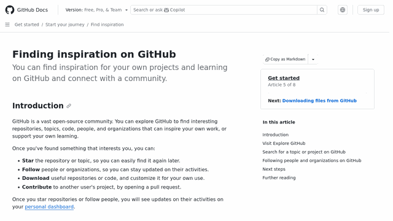
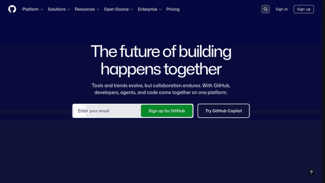

# website-to-gif (fork) [](https://github.com/danielpos178/website-to-gif/blob/main/LICENSE)

<p align="center">
    
</p>
<p align="center">
    <b>This Github Action automatically creates an animated GIF or WebP from a given web page to display on your project README (or anywhere else).</b>
</p>

## About this fork

This is a fork of [PabloLec/website-to-gif](https://github.com/PabloLec/website-to-gif) with the following fix applied:

- **Fixed `no_scroll` parameter** — the original action had a typo (`no_scoll`) in `action.yml` that didn't match the environment variable name read by the Python script (`INPUT_NO_SCROLL`), meaning the no-scroll mode never actually worked. This fork corrects the parameter name to `no_scroll` so it functions as documented.

## Usage

In your GitHub repo, create a workflow file or extend an existing one. (e.g. `.github/workflows/demo.yml`)

You must also include a step to `checkout` and commit back to the repo.

`.github/workflows/demo.yml`

```yaml
name: Generate demo file

on: workflow_dispatch

jobs:
  generate-gif:
    runs-on: ubuntu-latest
    steps:
      - uses: actions/checkout@v4
      - name: Website to file
        uses: danielpos178/website-to-gif@main
        with:
          url: "https://docs.github.com/en/get-started"
      - name: Commit file to GH repo
        run: |
          git config --global user.name "website-to-gif[bot]"
          git config --global user.email "github-actions[bot]@users.noreply.github.com"
          git add .
          git commit -m 'Update demo file' || echo "No changes to commit"
          git push
```

### Capturing without scrolling (fixed in this fork)

Use `no_scroll: true` to capture a static or animated screenshot without any page scrolling:

```yaml
- name: Website to WebP
  uses: danielpos178/website-to-gif@main
  with:
    url: "https://yoursite.com"
    file_format: "WebP"
    file_name: "demo"
    no_scroll: true
    time_per_frame: 100
    time_between_frames: 100
    number_of_frames: 50
    window_width: 1920
    window_height: 1080
```

> **Note:** In the original repo, `no_scoll: true` (with the typo) was silently ignored and the page would always scroll. This fork fixes that — `no_scroll: true` now works correctly.

See the [official GitHub Actions docs](https://docs.github.com/en/actions/reference/workflow-syntax-for-github-actions) to further customize your workflow.

## Inputs

| Name | Description | Default | Example |
|---|---|---|---|
| url | Web page URL to be captured. **Required** | | `url: "https://docs.github.com"` |
| save_path | File saving path, starts with `/`. Make sure the path already exists — this action will not create directories. | repo root | `save_path: "/docs/images/"` |
| file_format | Output file format, supports `GIF` and `WebP` | `GIF` | `file_format: "WebP"` |
| file_name | File name, **do not include extension or path** | `demo` | `file_name: "ss_25_tps_100"` |
| window_width | Browser window width | `1920` (px) | `window_width: 1366` |
| window_height | Browser window height | `1080` (px) | `window_height: 768` |
| start_y | Position where capture should start | `0` (px) | `start_y: 0` |
| stop_y | Position where capture should stop | bottom of page | `stop_y: 800` |
| final_width | Final file width | `640` (px) | `final_width: 1024` |
| final_height | Final file height | `360` (px) | `final_height: 576` |
| scroll_step | Number of pixels per scroll step | `25` (px) | `scroll_step: 50` |
| time_per_frame | Milliseconds per frame | `100` (ms) | `time_per_frame: 200` |
| start_delay | Milliseconds to wait before starting capture | `0` (ms) | `start_delay: 100` |
| no_scroll | Capture without page scroll, discards all scroll-related parameters. **Fixed in this fork.** | `false` | `no_scroll: true` |
| time_between_frames | Milliseconds between frame captures when `no_scroll` is true | `100` (ms) | `time_between_frames: 200` |
| number_of_frames | Number of frames to capture when `no_scroll` is true | `20` | `number_of_frames: 50` |
| resizing_filter | Filter used to resize frames, see [Pillow docs](https://pillow.readthedocs.io/en/stable/reference/Image.html?highlight=resize#PIL.Image.Image.resize) | `LANCZOS` | `resizing_filter: "LANCZOS"` |

## Examples

Increase or decrease `scroll_step` and `time_per_frame` to modify file rendering and file size.

#### `scroll_step: 15` `time_per_frame: 80`


#### `scroll_step: 25` `time_per_frame: 100`


#### `scroll_step: 50` `time_per_frame: 50`


#### `scroll_step: 50` `time_per_frame: 100`


#### `scroll_step: 50` `time_per_frame: 200`


You can also capture pages without scrolling:

#### `no_scroll: true` `time_per_frame: 100` `time_between_frames: 100` `number_of_frames: 50`


## WebP

WebP rendering will take **significantly longer** than GIF due to lossless quality and file size optimization.

## Contributing

Feel free to contribute!
To suggest a new feature or report a bug, open a new [issue](https://github.com/danielpos178/website-to-gif/issues).

## Credits

Original action by [PabloLec](https://github.com/PabloLec/website-to-gif).